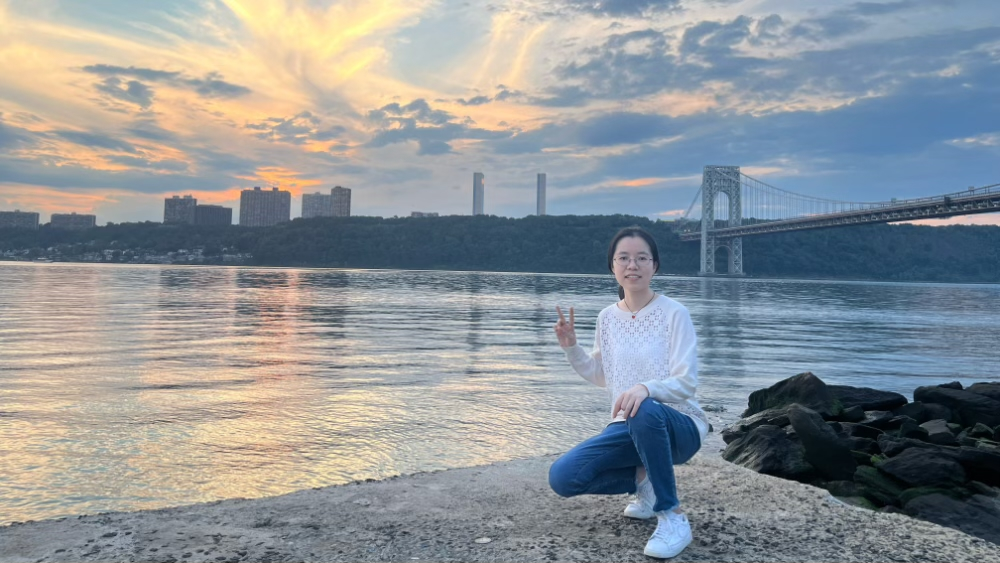

####   she/her
####   Second-year student in MPH Biostatistics  
####   Columbia University, Mailman School of Public Health

 

{width=70%}

 

I've obtained a BS in Statistics from [Shanghai University of Finance and Economics](https://english.sufe.edu.cn/) in 2022, and now I am studying for a MPH in Biostatistics from [Columbia University](https://www.mailman.columbia.edu/become-student/departments/biostatistics). 

 

#### Know more about me

Check out more about my experience in my [CV](Experience.html)

Here's my [Github repository](http://github.com/wuyiying2018/).

Connect with me through [Linkedin](https://www.linkedin.com/in/yiying-wu-9a0bab251/).

 

#### Contact Information

[Department of Biostatistics](http://www.mailman.columbia.edu/academic-departments/biostatistics)  
[Columbia Mailman School of Public Health](http://www.mailman.columbia.edu/)  
100 Haven Ave
 
New York, New York 10032  

Email: [yw3996@cumc.columbia.edu](mailto:yw3996@cumc.columbia.edu)  

